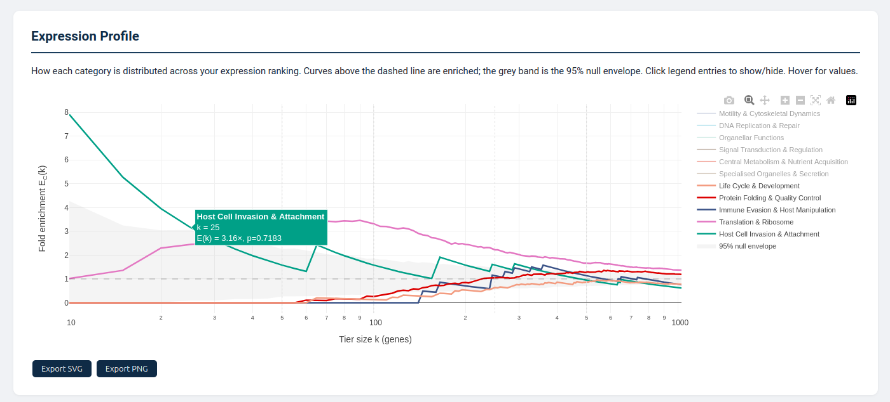
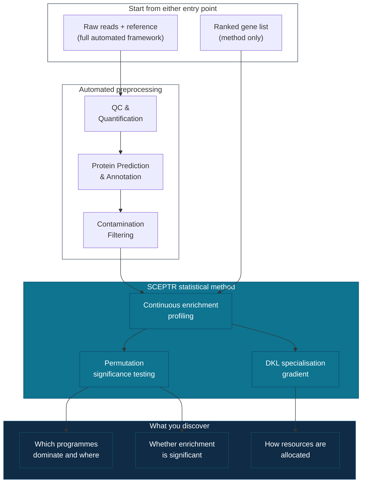

<p align="center">
  
</p>

<p align="center">
  <strong>Statistical Characterisation of Expression Profiles in Transcriptomes</strong>
</p>

<p align="center">
  <a href="https://www.nextflow.io/"></a>
  <a href="https://www.docker.com/"></a>
  <a href="LICENSE"></a>
</p>

<p align="center">
  <em>What is your transcriptome doing, and where is it investing its resources?</em>
</p>

---

Every transcriptome has a structure. A small fraction of genes dominates expression, and the functional programmes encoded in those genes shape cellular phenotype. But current methods throw this structure away. Differential expression reduces everything to binary up/down calls between conditions. ssGSEA and GSVA compress pathway activity into a single score. Standard GO enrichment applies one threshold and calls it quits!

**SCEPTR** takes a different approach. It ranks genes by expression and computes a **continuous enrichment function** for every functional category, evaluating enrichment at every gene rank across the entire expression gradient and applying adaptive kernel smoothing to produce smooth, differentiable curves. The result is an *enrichment profile* for every category: a curve showing whether a programme dominates the expression apex, emerges gradually at broader tiers, or sits at background levels throughout. These profile shapes are biologically meaningful. Translation machinery concentrated at the very top of expression looks fundamentally different from an antiviral immune response distributed across hundreds of moderately expressed genes, and SCEPTR distinguishes the two.

Because SCEPTR compares each tier against the sample's own transcriptome-wide background, it works from a single sample with no replicates, no control, and no comparative data. This makes it directly applicable to the datasets that fill real-world transcriptomics: single clinical isolates, irreplaceable field samples, experiments that happen before replicates are funded. Parasitology, environmental microbiology, emerging pathogen response, non-model organisms. If you have expression data, SCEPTR can tell you what your transcriptome is investing in.

> SCEPTR also includes a [comparison module](#comparing-two-conditions) for testing whether enrichment profiles differ between two conditions (e.g. mock vs infected) using gene-label permutation testing, but the core framework is designed around single-sample analysis.

<br>

<p align="center">
  
  <br>
  <sub><em>Interactive enrichment profile from the SCEPTR report. Each curve traces a functional category's enrichment across the full expression gradient. Here, Immune Evasion & Host Manipulation dominates the apex of <em>Toxoplasma gondii</em> tachyzoite expression (8.33x at k=15, driven by dense granule effectors), while Host Cell Invasion & Attachment peaks around k=30-40. The grey band shows the 95% null envelope from permutation testing. Hover for per-gene-rank values; click legend entries to show/hide categories.</em></sub>
</p>

<br>

## Prerequisites

- [Nextflow](https://www.nextflow.io/) >= 21.10.0
- [Docker](https://www.docker.com/) (recommended) or [Singularity](https://sylabs.io/singularity/)
- ~4 GB disk space for databases
- ~8 GB RAM recommended

## Quick Start

```bash
# Clone and set up (one-time, ~10 min)
git clone https://github.com/jsmccabe1/SCEPTR.git && cd SCEPTR
bash setup_databases.sh          # Downloads UniProt + GO (~3.5 GB)
docker build -t sceptr:1.0.0 .

# Run (interactive mode: auto-detects reads, validates inputs)
./run_sceptr.sh
```

Or specify everything directly:

```bash
# Parasite study with host filtering
./run_sceptr.sh -r data/reads -t parasite.fasta -c parasite_protozoan -H host.fasta

# Bacterial reference CDS (broad categories)
./run_sceptr.sh -r data/reads -t reference_cds.fasta -c bacteria

# Gram-negative specific (LPS, T3SS/T6SS, porins)
./run_sceptr.sh -r data/reads -t reference_cds.fasta -c bacteria_gram_negative

# De novo dinoflagellate assembly
./run_sceptr.sh -r data/reads -t trinity_assembly.fasta -c protist_dinoflagellate
```

<br>

## The Method

### Continuous enrichment profiling

The core idea is straightforward. Genes at the top of the expression hierarchy are not a random sample of the transcriptome. They are enriched for specific biological programmes, and which programmes dominate changes depending on how far down the hierarchy you look.

SCEPTR formalises this by computing a **continuous enrichment function** E<sub>C</sub>(t) for every functional category C. Genes are ranked by TPM, and the enrichment ratio is evaluated at every integer gene rank k from k=10 up to N/2. The raw discrete values are then smoothed with an adaptive Gaussian kernel (bandwidth proportional to the square root of the expected inter-member spacing, sigma = 0.5 * sqrt(N/|C|)) to yield a smooth, differentiable function of position along the expression gradient. The result is a continuous fold-enrichment curve, not just a handful of arbitrary thresholds.

A category enriched 9x at k=50 but falling to 1x by k=500 tells a different biological story than a category that only reaches significance at the broadest tier. The first is an **apex-concentrated** programme (e.g. translation in blood-stage malaria parasites). The second is a **distributed** programme (e.g. innate immunity during viral infection, spread across many moderately expressed genes). SCEPTR automatically classifies these profile shapes via linear trend analysis.

Statistical significance is assessed at both discrete tiers (Fisher's exact test with Benjamini-Hochberg correction) and across the continuous profile (permutation-based global profile test using supremum and integral statistics with 1,000 permutations). Both observed and null curves are smoothed with the same adaptive kernel to ensure valid comparison. The continuous test detects categories with profiles that deviate from the null expectation at any point along the gradient, with a 95% null envelope for visual interpretation.

### Measuring functional specialisation

To capture the overall picture, SCEPTR computes a **Kullback-Leibler divergence** D<sub>KL</sub> at each point along the expression gradient, measuring how different the functional composition of the top-k genes is from the transcriptome as a whole. The shape of this gradient is a quantitative phenotype of transcriptome organisation. A blood-stage malaria parasite with its extreme translational dominance shows a steep D<sub>KL</sub> gradient; a bacterium with more distributed functional investment shows a shallow one.

### Dual-method category assignment

Functional categories are assigned to genes through two complementary methods: keyword matching via word-boundary regex against UniProt annotations, and GO hierarchy traversal from curated anchor GO terms. Each assignment is tagged with its source (keyword, GO, or both) for full transparency. A GO-only ablation recovers 100% of significantly enriched categories across all validated organisms (mean Pearson r = 0.90 with the dual method), confirming that keywords are supplementary rather than load-bearing. External validation against 17 MSigDB Hallmark gene sets shows 100% concordance with independently curated pathway definitions.

### Two ways to use SCEPTR

**As a statistical method** - bring any annotated expression table and run enrichment profiling directly, skipping all preprocessing steps. SCEPTR computes continuous enrichment profiles, permutation-based significance, and D<sub>KL</sub> functional specialisation from your existing data.

**As an automated framework** - provide raw reads and a reference, and SCEPTR handles everything from QC to a finished interactive report in a single command.



<sub>*Protein prediction uses TransDecoder for de novo eukaryotic assemblies and direct CDS translation for bacterial and vertebrate host inputs. Contamination filtering is auto-enabled for eukaryotic assemblies.*</sub>

<br>

## What SCEPTR Produces

SCEPTR generates a self-contained **interactive HTML report** combining both functional (biological process / molecular function) and cellular component profiling in a single dashboard. The report is portable, embeddable as supplementary material, and designed for two audiences: a plain-English hero summary for quick interpretation, and full statistical detail (enrichment tables, continuous curves, D<sub>KL</sub>, profile shapes, category report cards) for deeper analysis.

### Interactive report contents

- **Hero summary** - Auto-generated plain-English description of the most prominent functional programmes
- **Continuous enrichment curves** - Interactive Plotly charts showing E<sub>C</sub>(k) for every category with 95% null envelope
- **D<sub>KL</sub> functional specialisation gradient** - How rapidly functional specialisation decays across the expression hierarchy
- **Enrichment tables** - Per-tier fold enrichment, p-values, FDR, profile trend, and significance flags
- **Category report cards** - Per-category detail with profile shape badge, assignment method breakdown, core specificity, and top genes
- **Methods summary** - Reproducible description of all statistical methods used

### Full output per analysis type

| File | Description |
|------|-------------|
| `{prefix}_BP_MF_report.html` | Interactive functional profiling report |
| `{prefix}_CC_report.html` | Interactive cellular component report |
| `{prefix}_report.html` | Combined report (both analyses in one file) |
| `{prefix}_BP_MF_enrichment_results.tsv` | Discrete tier enrichment statistics |
| `{prefix}_BP_MF_continuous_enrichment.tsv` | Smoothed continuous E<sub>C</sub>(t) values across the expression gradient |
| `{prefix}_BP_MF_assignment_methods.json` | Per-category breakdown of keyword vs GO assignment |
| `figures/*.png`, `figures/*.svg` | Publication-ready static figures (continuous enrichment, D<sub>KL</sub>, multi-tier bar chart) |

<sub>Cellular component outputs follow the same pattern with `_CC_` prefix.</sub>

### Other framework reports

| Report | What it shows |
|--------|--------------|
| **GO Enrichment** | Per-tier topGO enrichment with weight01 algorithm, interactive tables, and publication-ready figures |
| **Transcriptome Landscape** | Expression concentration (Gini coefficient), annotation completeness by tier, taxonomic distribution, functional composition shifts |
| **Contamination Report** | DIAMOND-based screening with optional host sequence removal for parasite/pathogen studies |
| **Quality Control** | FastQC + MultiQC aggregation |

<details>
<summary><strong>Full output directory structure</strong></summary>

```
results/
├── preprocessing/
│   ├── qc/                         # FastQC + MultiQC reports
│   │   ├── fastqc/
│   │   └── multiqc/
│   ├── quantification/             # Salmon index + quant.sf
│   ├── proteome/                   # Predicted proteins (.pep, .gff3)
│   ├── contamination/              # Filtering, host removal, visualisation
│   │   ├── host_filter/
│   │   └── visualisation/
│   └── annotation/                 # UniProt hits, GO terms, annotation summary
│
├── enrichment_profiles/            # Continuous enrichment profiling
│   ├── functional/
│   │   ├── {prefix}_BP_MF_report.html
│   │   ├── {prefix}_BP_MF_enrichment_results.tsv
│   │   ├── {prefix}_BP_MF_continuous_enrichment.tsv
│   │   ├── {prefix}_BP_MF_assignment_methods.json
│   │   ├── {prefix}_BP_MF_report_data.json
│   │   └── figures/
│   │       ├── {prefix}_BP_MF_continuous_enrichment.{png,svg}
│   │       ├── {prefix}_BP_MF_continuous_dkl.{png,svg}
│   │       └── {prefix}_BP_MF_multi_tier_enrichment.{png,svg}
│   └── cellular/
│       ├── {prefix}_CC_report.html
│       ├── {prefix}_CC_enrichment_results.tsv
│       ├── {prefix}_CC_continuous_enrichment.tsv
│       ├── {prefix}_CC_assignment_methods.json
│       ├── {prefix}_CC_report_data.json
│       └── figures/
│           ├── {prefix}_CC_continuous_enrichment.{png,svg}
│           ├── {prefix}_CC_continuous_dkl.{png,svg}
│           └── {prefix}_CC_multi_tier_enrichment.{png,svg}
│
├── go_enrichment/                  # Per-tier topGO enrichment
│   ├── reports/
│   ├── data/
│   └── figures/
│
├── landscape/                      # Transcriptome overview
│   ├── {prefix}_landscape_report.html
│   ├── {prefix}_landscape_stats.json
│   └── figures/
│
├── integrated_data/                # Merged annotation + expression table
│   └── integrated_annotations_expression.tsv
│
├── comparison/                     # Cross-sample comparison (when used)
│
└── pipeline_info/                  # Nextflow execution reports
```

</details>

<br>

## Category Sets

SCEPTR ships with organism-specific functional category sets optimised for different study systems:

| Category Set             | Description                             | Example Organisms                        |
|--------------------------|-----------------------------------------|------------------------------------------|
| `general`                | Universal functional categories         | Any organism (default)                   |
| `human_host`             | Human host response (33 detailed pathways) | Human infection, inflammation, clinical studies |
| `vertebrate_host`        | Vertebrate host response (17 broad categories) | Mouse, fish, bird host-side studies      |
| `cancer`                 | Hallmarks of cancer (17 categories)     | Tumour transcriptomes, cell lines        |
| `bacteria`               | Prokaryotic functional systems (14 broad) | *Salmonella*, *E. coli*, *Mycobacterium* |
| `bacteria_gram_negative` | Gram-negative bacteria (18 categories)  | *E. coli*, *Pseudomonas*, *Salmonella*   |
| `bacteria_gram_positive` | Gram-positive bacteria (18 categories)  | *Staphylococcus*, *Streptococcus*, *Bacillus* |
| `parasite_protozoan`     | Protozoan parasite biology              | *Plasmodium*, *Toxoplasma*, *Leishmania* |
| `helminth_nematode`      | Parasitic nematode biology (15 categories) | *Ascaris*, *Haemonchus*, *Brugia*, hookworms |
| `helminth_platyhelminth` | Fluke and tapeworm biology (15 categories) | *Schistosoma*, *Fasciola*, *Echinococcus* |
| `fungi`                  | Fungal biology (15 categories)          | *Aspergillus*, *Candida*, *Fusarium*     |
| `plant`                  | Plant-specific processes                | *Arabidopsis*, crop species              |
| `protist_dinoflagellate` | Dinoflagellate-specific processes        | *Symbiodinium*, HAB species              |
| `insect`                 | Insect biology (16 categories)          | *Drosophila*, mosquitoes, bees, beetles  |

Each category uses **dual-method assignment** (keyword + GO hierarchy) with optional **core keywords** that provide high-confidence diagnostic terms, reporting a specificity percentage alongside enrichment statistics.

<details>
<summary><strong>bacteria vs bacteria_gram_negative vs bacteria_gram_positive</strong></summary>

The `bacteria` set provides 14 broad functional categories suitable for any prokaryote. The gram-specific sets split and specialise these into 18 categories each, reflecting the distinct biology of gram-negative and gram-positive organisms:

| bacteria (14 broad) | bacteria_gram_negative (18 specific) | bacteria_gram_positive (18 specific) |
|---|---|---|
| Cell Wall & Envelope | Outer Membrane & LPS, Peptidoglycan & Cell Wall, Periplasm & Protein Export | Cell Wall & Peptidoglycan, Teichoic Acids & Surface Polymers, Sortase & Surface Proteins |
| Virulence & Pathogenesis | Virulence & Pathogenesis, Type III Secretion System, Type IV & Type VI Secretion | Virulence & Pathogenesis, Sporulation & Germination, Competence & DNA Uptake |
| Transport & Secretion | Transport & Uptake | Transport & Uptake |
| Signal Transduction | Signal Transduction (AHL quorum sensing) | Signal Transduction (Agr peptide quorum sensing) |
| Antimicrobial Resistance | AMR (ESBL, carbapenemase, AcrAB-TolC) | AMR (vancomycin, methicillin/mecA, erm methylase) |
| Iron Acquisition & Siderophores | Iron Acquisition (enterobactin, pyoverdine, TonB) | Iron Acquisition (Isd heme system, staphyloferrin) |

Use `bacteria_gram_negative` for Proteobacteria and other diderm organisms with outer membranes (LPS, porins, T3SS/T6SS). Use `bacteria_gram_positive` for Firmicutes and other monoderm organisms (teichoic acids, sortase-anchored proteins, sporulation, competence).

</details>

<details>
<summary><strong>human_host vs vertebrate_host</strong></summary>

The `human_host` set provides 33 detailed pathway-level categories optimised for human infection, inflammation, and clinical studies. The `vertebrate_host` set provides 17 broader categories suitable for non-human vertebrate hosts (mouse, fish, birds) where pathway-specific annotations are sparser:

| vertebrate_host (17 broad) | human_host (33 detailed) |
|---|---|
| Interferon & Antiviral Response | Interferon Response (Type I), Interferon Response (Type II), Interferon Response (Type III), Antiviral Defense |
| Inflammatory Signaling | TNF-NF-kB Signaling, Chemokine Signaling, Inflammasome & IL-1 Signaling, Interleukin Signaling |
| Signaling Pathways | JAK-STAT Signaling, MAPK-RAS Signaling, PI3K-AKT-mTOR Signaling, TGF-Beta & Developmental Signaling |
| Innate Immunity | Pattern Recognition & TLR Signaling, Complement System |
| Adaptive Immunity | Adaptive Immunity |
| Stress Response | Unfolded Protein Response, Hypoxia Response, Oxidative Stress & ROS |
| Metabolism | Glycolysis, Oxidative Phosphorylation, Fatty Acid Metabolism, Cholesterol & Steroid Metabolism |
| Cell Death | Apoptosis, Autophagy |
| Cell Cycle & Proliferation | E2F Targets & DNA Replication, G2M Checkpoint & Mitosis |
| Tissue Repair & Coagulation | Tissue Repair & Remodelling, Coagulation & Thromboinflammation |

Use `human_host` for human-derived samples requiring pathway-level resolution. Use `vertebrate_host` for broader vertebrate studies.

</details>

<details>
<summary><strong>helminth_nematode vs helminth_platyhelminth</strong></summary>

Two specialised helminth category sets reflecting distinct biology:

| helminth_nematode (15 categories) | helminth_platyhelminth (15 categories) |
|---|---|
| Cuticle & Molting | Tegument & Surface Biology |
| Dauer & Larval Development | Lifecycle & Morphological Development |
| Sensory & Chemoreception | Neoblasts & Stem Cell Biology |
| - | Egg Biology & Granuloma Formation |

Both share analogous categories for immune evasion, neuromuscular function, reproduction, digestion, detoxification, metabolism, and signaling, but with organism-specific GO anchors and keywords.

</details>

<details>
<summary><strong>Custom category sets</strong></summary>

```bash
nextflow run main.nf \
  --reads "data/*_{1,2}.fastq.gz" \
  --transcripts assembly.fasta \
  --category_set custom \
  --custom_functional_categories my_functional.json \
  --custom_cellular_categories my_cellular.json \
  -profile docker
```

Category JSON format (v2):

```json
{
  "Category Name": {
    "keywords": ["broad keyword", "another keyword"],
    "anchor_go_ids": ["GO:0000001"],
    "core_keywords": ["diagnostic keyword"]
  }
}
```

The `core_keywords` field is optional. If omitted or empty, all matches are treated as "extended" (core specificity 0%).

</details>

<br>

## Comparing Two Conditions

If you have two conditions (mock vs infected, control vs treated), you can run SCEPTR on each sample independently and then compare their enrichment profiles. This asks a fundamentally different question from differential expression: not "which genes change?" but "does the functional architecture of the transcriptome shift between states?"

SCEPTR's comparison module aggregates genes into functional categories and uses a gene-label permutation test (10,000 permutations, per-tier BH correction) to assess whether enrichment differences are larger than expected by chance. Because the test builds its null distribution from the data itself, no variance estimate from replicates is needed. This is not a replacement for replicated experimental designs. It is a principled way to compare enrichment profiles when replicates are unavailable.

<details>
<summary><b>Usage</b></summary>

```bash
# First, run SCEPTR on each condition separately:
./run_sceptr.sh -r data/mock_reads -t reference.fasta -c vertebrate_host -o results_mock
./run_sceptr.sh -r data/infected_reads -t reference.fasta -c vertebrate_host -o results_infected

# Then compare:
./run_sceptr.sh --compare \
  --condition-a results_mock/integrated_data/integrated_annotations_expression.tsv \
  --condition-b results_infected/integrated_data/integrated_annotations_expression.tsv \
  --label-a Mock --label-b Infected \
  -c vertebrate_host

# Or with Nextflow directly:
nextflow run main.nf -entry compare \
  --condition_a results_mock/integrated_data/integrated_annotations_expression.tsv \
  --condition_b results_infected/integrated_data/integrated_annotations_expression.tsv \
  --label_a "Mock" --label_b "Infected" \
  --category_set vertebrate_host \
  --outdir results_comparison \
  -profile docker
```

Both samples must use the same reference transcriptome.

</details>

<details>
<summary><b>Outputs</b></summary>

| File | Contents |
|------|----------|
| Differential enrichment TSV | Category x tier fold changes, FC difference, permutation p-value, BH-adjusted FDR |
| Concordance TSV | Spearman rho (with Fisher z-transform CI) and Jaccard similarity per tier |
| HTML dashboard report | Summary statistics, concordance metrics, differential enrichment table, embedded figures |
| Figures (PNG + SVG) | Radar overlay, differential heatmap, grouped bar plot, volcano plot, gradient overlay |

</details>

<details>
<summary><b>Interpreting results</b></summary>

| Metric | Meaning |
|--------|---------|
| Significant positive FC_Diff | Category more enriched in condition B at that tier |
| Significant negative FC_Diff | Category more enriched in condition A |
| Spearman rho > 0.7 | Conditions share similar functional investment patterns |
| Spearman rho < 0.3 | Fundamentally different functional allocation |

The permutation test evaluates per-tier enrichment differences. The module identifies biologically meaningful shifts that would otherwise require subjective side-by-side inspection, however results should be treated as exploratory.

</details>

<br>

## Installation

### Step 1: Clone

```bash
git clone https://github.com/jsmccabe1/SCEPTR.git
cd SCEPTR
```

### Step 2: Download databases

SCEPTR requires UniProt Swiss-Prot, DIAMOND databases, and the Gene Ontology hierarchy (~3.5 GB total). The setup script downloads and builds everything automatically:

```bash
bash setup_databases.sh           # Full setup
bash setup_databases.sh --check   # Verify database status
```

The script is idempotent so it skips databases that already exist.

### Step 3: Build Docker image

```bash
docker build -t sceptr:1.0.0 .
```

<br>

## Usage

### Interactive launcher (recommended)

```bash
./run_sceptr.sh
```

Auto-detects read files, validates inputs, and builds the command interactively. Supports four modes:

1. **Full framework** - Process raw reads to enrichment report
2. **Method only** - Run enrichment profiling on your own annotated expression table (no preprocessing required)
3. **Compare conditions** - Compare two existing SCEPTR outputs
4. **Re-run enrichment** - Re-analyse existing results with different categories or parameters

### Command-line launcher

```bash
# Paired-end reads (default)
./run_sceptr.sh -r data/reads -t assembly.fasta -c bacteria

# Single-end reads
./run_sceptr.sh -r 'data/*.fastq.gz' -t cds.fasta -c bacteria --single-end

# With host contamination removal (parasite studies)
./run_sceptr.sh -r data/reads -t parasite.fasta -c parasite_protozoan -H host.fasta

# Pre-translated host proteome (faster)
./run_sceptr.sh -r data/reads -t parasite.fasta -c parasite_protozoan --host-proteome host_proteins.fasta
```

<details>
<summary><strong>Direct Nextflow commands</strong></summary>

```bash
# Paired-end eukaryote
nextflow run main.nf \
  --reads "data/*_{1,2}.fastq.gz" \
  --transcripts assembly.fasta \
  --category_set general \
  --outdir results \
  -profile docker

# Bacterial CDS (auto-skips TransDecoder and contaminant filtering)
nextflow run main.nf \
  --reads "data/*_{1,2}.fastq.gz" \
  --transcripts reference_cds.fasta \
  --category_set bacteria \
  --outdir results \
  -profile docker

# Single-end
nextflow run main.nf \
  --reads "data/*.fastq.gz" \
  --transcripts cds.fasta \
  --category_set bacteria_gram_negative \
  --single_end true \
  --outdir results \
  -profile docker

# Host response to infection
nextflow run main.nf \
  --reads "data/*.fastq.gz" \
  --transcripts Homo_sapiens.GRCh38.cds.all.fa \
  --category_set vertebrate_host \
  --single_end true \
  --outdir results \
  -profile docker
```

</details>

### Organism-aware processing

SCEPTR automatically adapts based on `--category_set`:

| Feature               | Eukaryote (default)               | Bacteria / Bacteria Gram-*          | Vertebrate Host                   |
|-----------------------|-----------------------------------|-------------------------------------|-----------------------------------|
| ORF prediction        | TransDecoder                      | Direct CDS translation (table 11)   | Direct CDS translation (table 1)  |
| Contaminant filtering | Enabled                           | Auto-skipped                        | Auto-skipped                      |
| Category keywords     | Eukaryotic processes              | Prokaryotic processes               | Host response processes           |
| Input expectation     | Trinity assembly or transcriptome | Reference CDS file                  | Reference CDS file (e.g. Ensembl) |

<br>

<details>
<summary><strong>Full parameter reference</strong></summary>

### Required

| Parameter       | Description                                                              |
|-----------------|--------------------------------------------------------------------------|
| `--reads`       | Read files, glob pattern (e.g., `"data/*_{1,2}.fastq.gz"`) or directory |
| `--transcripts` | Reference transcriptome or CDS FASTA file                                |

### Key options

| Parameter            | Default          | Description                               |
|----------------------|------------------|-------------------------------------------|
| `--category_set`     | `general`        | Functional category set (see table above) |
| `--single_end`       | `false`          | Enable single-end read mode               |
| `--outdir`           | `results`        | Output directory                          |
| `--output_prefix`    | `sceptr`         | Prefix for output files                   |
| `--expression_tiers` | `50,100,250,500` | Comma-separated expression tier sizes     |

### Continuous enrichment

| Parameter                      | Default | Description                                        |
|--------------------------------|---------|----------------------------------------------------|
| `--explot_continuous`          | `true`  | Compute continuous enrichment functions             |
| `--explot_continuous_step`     | `5`     | Output resampling step (enrichment is computed at every gene rank internally) |
| `--explot_continuous_k_min`    | `10`    | Minimum gene rank k                                 |
| `--explot_continuous_k_max`    | N/2     | Maximum gene rank k (default: half of total genes)  |
| `--explot_profile_permutations`| `1000`  | Permutations for global profile significance test   |

### Host filtering (parasite/pathogen studies)

| Parameter              | Default | Description                                   |
|------------------------|---------|-----------------------------------------------|
| `--host_transcriptome` | -       | Host transcriptome FASTA (will be translated) |
| `--host_proteome`      | -       | Host proteome FASTA (used directly, faster)   |
| `--skip_host_filter`   | `false` | Disable host filtering                        |

### Contamination filtering

| Parameter              | Default | Description                             |
|------------------------|---------|-----------------------------------------|
| `--identity_threshold` | `50.0`  | Minimum % identity for contaminant hits |
| `--coverage_threshold` | `30.0`  | Minimum % query coverage                |
| `--evalue_threshold`   | `1e-3`  | Maximum e-value                         |

### Cross-sample comparison

| Parameter           | Default  | Description                                     |
|---------------------|----------|-------------------------------------------------|
| `--condition_a`     | -        | Path to condition A `integrated_annotations_expression.tsv` |
| `--condition_b`     | -        | Path to condition B `integrated_annotations_expression.tsv` |
| `--label_a`         | `Condition_A` | Display label for condition A              |
| `--label_b`         | `Condition_B` | Display label for condition B              |
| `--n_permutations`  | `10000`  | Number of gene-label permutations               |
| `--comparison_seed` | `42`     | Random seed for reproducibility                 |

### Single-end options

| Parameter    | Default | Description                                     |
|--------------|---------|-------------------------------------------------|
| `--fld_mean` | `250`   | Fragment length distribution mean               |
| `--fld_sd`   | `25`    | Fragment length distribution standard deviation |

### Skip flags

| Parameter               | Description                                                              |
|-------------------------|--------------------------------------------------------------------------|
| `--skip_transdecoder`   | Skip TransDecoder; use direct CDS translation                            |
| `--skip_contamination`  | Skip contaminant filtering (auto-enabled for bacteria/bacteria_gram_*/human_host/vertebrate_host) |
| `--skip_explot`         | Skip continuous enrichment profiling                                     |
| `--skip_landscape`      | Skip landscape characterisation                                          |

</details>

<br>

## Repository Structure

<details>
<summary><strong>Click to expand</strong></summary>

```
SCEPTR/
├── main.nf                  # Main framework workflow
├── nextflow.config          # Framework configuration
├── run_sceptr.sh            # Interactive launcher
├── setup_databases.sh       # Database download/build script
├── Dockerfile               # Container definition
├── LICENSE                  # MIT License
├── README.md
├── bin/                     # Framework scripts
│   ├── annotation/          # UniProt annotation scripts
│   ├── contamination/       # Contaminant filtering scripts
│   ├── enrichment/          # GO enrichment scripts
│   └── sceptr_compare.py    # Cross-sample comparison script
├── modules/                 # Nextflow modules
│   ├── annotation.nf
│   ├── comparison.nf        # Cross-sample comparison process
│   ├── contamination.nf
│   ├── enrichment/
│   ├── explot/              # Continuous enrichment profiling
│   │   ├── cli/             # functional_profiling_cli.py, cellular_profiling_cli.py, generate_report_cli.py
│   │   ├── categories/      # Organism-specific category JSON files
│   │   ├── categorisation.py
│   │   ├── enrichment.py
│   │   ├── continuous_enrichment.py
│   │   ├── go_utils.py
│   │   ├── visualisation/   # Static figure generation (bar charts, continuous curves)
│   │   └── reporting/       # Interactive HTML report generator
│   ├── landscape/           # Transcriptome landscape module
│   ├── qc.nf
│   ├── salmon.nf
│   └── transdecoder.nf
├── workflows/               # Nextflow sub-workflows
└── data/                    # Databases (created by setup_databases.sh)
    ├── uniprot/             # UniProt DIAMOND database
    ├── contaminants/        # Contaminant DIAMOND database
    └── go/                  # Gene Ontology hierarchy
```

</details>

<br>

<p align="center"><sub><em>Slainte a chara!</em></sub></p>

## Citation

If you use SCEPTR in your research, please cite:

> McCabe, J.S., and Janouskovec, J. (2026). SCEPTR: continuous enrichment profiling reveals functional architecture across the expression gradient.

## License

MIT License. See [LICENSE](LICENSE) for details.

## Issues & Contributions

Bug reports and feature requests: [GitHub Issues](https://github.com/jsmccabe1/SCEPTR/issues)
