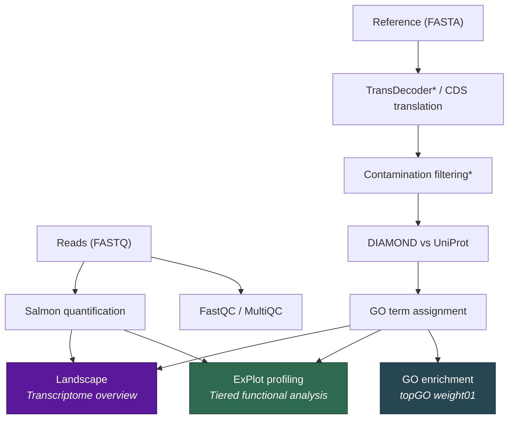

<p align="center">
  
</p>

<p align="center">
  <strong>Single-sample Characterisation of Expression Profiles in Transcriptomics</strong>
</p>

<p align="center">
  <a href="https://www.nextflow.io/"></a>
  <a href="https://www.docker.com/"></a>
  <a href="LICENSE"></a>
</p>

<p align="center">
  <em>What is your transcriptome doing, and where is it investing its resources?</em>
</p>

---

**SCEPTR** is a Nextflow pipeline that reveals the functional architecture of a transcriptome from a single RNA-seq sample requiring no replicates, no control, and no comparative data. It partitions genes into expression tiers and tests for functional enrichment at each tier, exposing *where* in the expression hierarchy an organism invests its transcriptional resources.

This is designed for the data you actually have: the single clinical isolate, the irreplaceable field sample, the pilot experiment before replicates are funded. Parasitology, environmental microbiology, non-model organisms, emerging pathogen response. If replicates are unavailable, SCEPTR extracts biology that flat gene lists and single-threshold methods miss.

> **Have two conditions but no replicates?** SCEPTR also includes an optional [comparison module](#comparing-two-conditions) that tests whether functional profiles differ between conditions using permutation testing, but the core tool works from a single sample alone.

<br>

<p align="center">
  
  <br>
  <sub><em><strong>Example SCEPTR ExPlot outputs. (A)</strong> Functional composition across the expression gradient in SARS-CoV-2-infected human host cells (Calu-3), showing immune and stress response programmes emerging alongside constitutive translation. <strong>(B)</strong> Expression concentration and distribution for a marine dinoflagellate transcriptome. <strong>(C)</strong> Functional expression radar profile for an apicomplexan parasite isolate. <strong>(D)</strong> Multi-tier functional category enrichment for <em>Plasmodium falciparum</em> 3D7, with significant categories marked.</em></sub>
</p>

<br>

## Quick Start

```bash
# Clone and set up (one-time, ~5 min)
git clone https://github.com/jsmccabe1/SCEPTR.git && cd SCEPTR
bash setup_databases.sh          # Downloads UniProt + GO (~3.5 GB)
docker build -t sceptr:1.0.0 .

# Run (interactive mode: auto-detects reads, validates inputs)
./run_sceptr.sh
```

Or specify everything directly:

```bash
# Parasite study with host filtering
./run_sceptr.sh -r data/reads -t parasite.fasta -c parasite_protozoan -H host.fasta

# Bacterial reference CDS (broad categories)
./run_sceptr.sh -r data/reads -t reference_cds.fasta -c bacteria

# Gram-negative specific (LPS, T3SS/T6SS, porins)
./run_sceptr.sh -r data/reads -t reference_cds.fasta -c bacteria_gram_negative

# De novo dinoflagellate assembly
./run_sceptr.sh -r data/reads -t trinity_assembly.fasta -c protist_dinoflagellate
```

<br>

## What SCEPTR Produces

SCEPTR generates self-contained HTML dashboard reports (portable, single-file, embeddable as supplementary material):

| Report | What it shows |
|--------|--------------|
| **ExPlot Functional Profiling** | Enrichment of curated functional categories across expression tiers, with fold changes, FDR, bootstrap stability, core specificity scores, and radar/bar visualisations |
| **GO Enrichment** | Per-tier topGO enrichment with weight01 algorithm, interactive tables, and publication-ready figures (PNG + SVG) |
| **Transcriptome Landscape** | Expression concentration (Gini), annotation completeness by tier, taxonomic distribution, functional composition shifts |
| **Contamination Report** | DIAMOND-based screening with optional host sequence removal for parasite/pathogen studies |
| **Quality Control** | FastQC + MultiQC aggregation |

<details>
<summary><strong>Full output directory structure</strong></summary>

```
results/
├── quality_control/
│   ├── fastqc/                     # Per-sample FastQC reports
│   └── multiqc/                    # Aggregated MultiQC report
├── quantification/
│   ├── quant.sf                    # Salmon transcript quantification
│   └── index/                      # Salmon index files
├── proteome/                       # Predicted proteins (.pep, .gff3)
├── contamination/
│   ├── filtered_proteome.fasta     # Clean proteome after filtering
│   ├── contaminant_report.txt
│   ├── contaminant_details.csv
│   ├── host_filter/                # Host sequence removal (if enabled)
│   └── visualisation/              # Contamination analysis dashboard
├── annotation/                     # UniProt functional annotations
│   ├── final_annotations.tsv
│   ├── protein_annotations.tsv
│   └── annotation_summary.html
├── integrated_data/
│   └── integrated_annotations_expression.tsv
├── go_enrichment/
│   ├── reports/                    # HTML dashboards
│   ├── data/                       # Enrichment results + GO term tables
│   └── figures/                    # Individual plots (PNG + SVG)
├── expression_profiles/            # ExPlot functional profiling
│   ├── functional/
│   │   ├── {prefix}_BP_MF_report.html
│   │   ├── {prefix}_BP_MF_enrichment_results.tsv
│   │   ├── {prefix}_BP_MF_core_specificity.json
│   │   └── figures/
│   └── cellular/
│       ├── {prefix}_CC_report.html
│       ├── {prefix}_CC_enrichment_results.tsv
│       ├── {prefix}_CC_core_specificity.json
│       └── figures/
├── landscape/
│   ├── {prefix}_landscape_report.html
│   ├── {prefix}_landscape_stats.json
│   └── figures/
└── pipeline_info/                  # Nextflow execution reports
```

</details>

<br>

## How It Works



<sub>*TransDecoder runs for de novo eukaryotic assemblies; bacteria/virus/vertebrate host inputs use direct CDS translation. Contamination filtering is auto-skipped for non-eukaryotic inputs.*</sub>

The core innovation is **ExPlot**: genes are ranked by expression (TPM), partitioned into tiers (default: top 50, 100, 250, 500), and each tier is tested for functional category enrichment against the full transcriptome background. Categories are assigned by a **dual-method** system where keywords are matched via word-boundary regex *and* the GO ID hierarchy is traversed, with each assignment method recorded for transparency. This reveals the organism's functional investment hierarchy: which biological programmes dominate the expression apex and which emerge only at broader tiers.

<br>

## Validated Across Kingdoms

SCEPTR has been validated across four phylogenetically diverse systems:

| Organism | Category Set | Key Finding |
|----------|-------------|-------------|
| **_Plasmodium falciparum_** (blood-stage) | `parasite_protozoan` | Translational dominance at apex; invasion machinery at broader tiers |
| **_Salmonella_ Typhimurium** (3 replicates) | `bacteria` | Reproducibility ρ > 0.88 across tiers; biological differences correctly detected |
| **Calu-3 human cells** (SARS-CoV-2 infected) | `vertebrate_host` | Immune reprogramming distinguished from constitutive translation; validated against ssGSEA |
| **_Durusdinium trenchii_** (heat stress) | `protist_dinoflagellate` | Functional investment hierarchy: photosynthesis → nutrient acquisition → photoprotection → translation |

<br>

## Category Sets

SCEPTR ships with organism-specific functional category sets optimised for different study systems:

| Category Set             | Description                             | Example Organisms                        |
|--------------------------|-----------------------------------------|------------------------------------------|
| `general`                | Universal functional categories         | Any organism (default)                   |
| `parasite_protozoan`     | Protozoan parasite biology              | *Plasmodium*, *Toxoplasma*, *Leishmania* |
| `parasite_metazoan`      | Metazoan parasite biology               | Helminths, arthropod parasites           |
| `protist_dinoflagellate` | Dinoflagellate-specific processes        | *Symbiodinium*, HAB species              |
| `bacteria`               | Prokaryotic functional systems (14 broad) | *Salmonella*, *E. coli*, *Mycobacterium* |
| `bacteria_gram_negative` | Gram-negative bacteria (18 categories)  | *E. coli*, *Pseudomonas*, *Salmonella*   |
| `bacteria_gram_positive` | Gram-positive bacteria (18 categories)  | *Staphylococcus*, *Streptococcus*, *Bacillus* |
| `virus`                  | Viral life cycle processes              | RNA/DNA viruses                          |
| `vertebrate_host`        | Host immune/defence response (11 broad) | Host-side infection studies              |
| `vertebrate_host_hallmark` | Hallmark-resolution pathways (28 specific) | Host studies requiring pathway-level detail |
| `model_organism`         | Well-characterised species              | Mouse, human, fly, worm, yeast           |
| `plant`                  | Plant-specific processes                | *Arabidopsis*, crop species              |

Each category uses **dual-method assignment** (keyword + GO hierarchy) with optional **core keywords** to provide high-confidence diagnostic terms that report a specificity percentage alongside enrichment statistics.

<details>
<summary><strong>bacteria vs bacteria_gram_negative vs bacteria_gram_positive</strong></summary>

The `bacteria` set provides 14 broad functional categories suitable for any prokaryote. The gram-specific sets split and specialise these into 18 categories each, reflecting the distinct biology of gram-negative and gram-positive organisms:

| bacteria (14 broad) | bacteria_gram_negative (18 specific) | bacteria_gram_positive (18 specific) |
|---|---|---|
| Cell Wall & Envelope | Outer Membrane & LPS, Peptidoglycan & Cell Wall, Periplasm & Protein Export | Cell Wall & Peptidoglycan, Teichoic Acids & Surface Polymers, Sortase & Surface Proteins |
| Virulence & Pathogenesis | Virulence & Pathogenesis, Type III Secretion System, Type IV & Type VI Secretion | Virulence & Pathogenesis, Sporulation & Germination, Competence & DNA Uptake |
| Transport & Secretion | Transport & Uptake | Transport & Uptake |
| Signal Transduction | Signal Transduction (AHL quorum sensing) | Signal Transduction (Agr peptide quorum sensing) |
| Antimicrobial Resistance | AMR (ESBL, carbapenemase, AcrAB-TolC) | AMR (vancomycin, methicillin/mecA, erm methylase) |
| Iron Acquisition & Siderophores | Iron Acquisition (enterobactin, pyoverdine, TonB) | Iron Acquisition (Isd heme system, staphyloferrin) |

Use `bacteria_gram_negative` for Proteobacteria and other diderm organisms with outer membranes (LPS, porins, T3SS/T6SS). Use `bacteria_gram_positive` for Firmicutes and other monoderm organisms (teichoic acids, sortase-anchored proteins, sporulation, competence).

</details>

<details>
<summary><strong>vertebrate_host vs vertebrate_host_hallmark</strong></summary>

The `vertebrate_host` set provides 11 broad functional categories suitable for initial characterisation. The `vertebrate_host_hallmark` set splits these into 28 MSigDB Hallmark-inspired pathway categories for higher biological resolution:

| vertebrate_host (11 broad) | vertebrate_host_hallmark (28 specific) |
|---|---|
| Innate Immunity | Interferon Response (Type I), Interferon Gamma Response, Antiviral Defense, Pattern Recognition & TLR Signaling, Complement System |
| Inflammatory Response | TNF-NF-kB Signaling, Chemokine Signaling, Inflammasome & IL-1 Signaling |
| Cell Signalling | JAK-STAT Signaling, MAPK-RAS Signaling, PI3K-AKT-mTOR Signaling, TGF-Beta & Developmental Signaling |
| Stress Response | Unfolded Protein Response, Hypoxia Response, Oxidative Stress & ROS |
| Metabolism & Energy | Glycolysis, Oxidative Phosphorylation, Fatty Acid Metabolism, Cholesterol & Steroid Metabolism |
| Apoptosis & Cell Death | Apoptosis, Autophagy |
| Cell Cycle & Proliferation | E2F Targets & DNA Replication, G2M Checkpoint & Mitosis |
| *(new)* | DNA Damage & Repair, Protein Homeostasis |
| Adaptive Immunity | Adaptive Immunity |
| Translation & Ribosome | Translation & Ribosome |
| Tissue Repair & Remodelling | Tissue Repair & Remodelling |

Use `vertebrate_host_hallmark` when you need to distinguish, for example, interferon-driven from complement-driven innate immunity, or glycolysis from oxidative phosphorylation.

</details>

<details>
<summary><strong>Custom category sets</strong></summary>

```bash
nextflow run main.nf \
  --reads "data/*_{1,2}.fastq.gz" \
  --transcripts assembly.fasta \
  --category_set custom \
  --custom_functional_categories my_functional.json \
  --custom_cellular_categories my_cellular.json \
  -profile docker
```

Category JSON format (v2):

```json
{
  "Category Name": {
    "keywords": ["broad keyword", "another keyword"],
    "anchor_go_ids": ["GO:0000001"],
    "core_keywords": ["diagnostic keyword"]
  }
}
```

The `core_keywords` field is optional. If omitted or empty, all matches are treated as "extended" (core specificity 0%).

</details>

<br>

## Comparing Two Conditions

If you have two conditions without replicates (mock vs infected, control vs treated), you can run SCEPTR on each sample independently and then compare their functional profiles.

Standard DE tools (DESeq2, edgeR) cannot run with n=1 per condition because they need variance estimates that require replicates. SCEPTR's comparison module asks a different question at a different scale: not "which of 20,000 genes differ?" (impossible without replicates) but "do these ~10 functional categories differ in their enrichment?" (tractable). Aggregating genes into categories is what makes the statistics work. A gene-label permutation test (10,000 permutations, per-tier BH correction) builds its null distribution from the data itself, meaning no variance estimate is needed! It's important to note; this is not a replacement for replicated experimental designs. It is a principled alternative when replicates are unavailable.

<details>
<summary><b>Usage</b></summary>

```bash
# First, run SCEPTR on each condition separately:
./run_sceptr.sh -r data/mock_reads -t reference.fasta -c vertebrate_host -o results_mock
./run_sceptr.sh -r data/infected_reads -t reference.fasta -c vertebrate_host -o results_infected

# Then compare:
./run_sceptr.sh --compare \
  --condition-a results_mock/integrated_data/integrated_annotations_expression.tsv \
  --condition-b results_infected/integrated_data/integrated_annotations_expression.tsv \
  --label-a Mock --label-b Infected \
  -c vertebrate_host

# Or with Nextflow directly:
nextflow run main.nf -entry compare \
  --condition_a results_mock/integrated_data/integrated_annotations_expression.tsv \
  --condition_b results_infected/integrated_data/integrated_annotations_expression.tsv \
  --label_a "Mock" --label_b "Infected" \
  --category_set vertebrate_host \
  --outdir results_comparison \
  -profile docker
```

Both samples must use the same reference transcriptome.

</details>

<details>
<summary><b>Outputs</b></summary>

| File | Contents |
|------|----------|
| Differential enrichment TSV | Category × tier fold changes, FC difference, permutation p-value, BH-adjusted FDR |
| Concordance TSV | Spearman ρ (with Fisher z-transform CI) and Jaccard similarity per tier |
| HTML dashboard report | Summary statistics, concordance metrics, differential enrichment table, embedded figures |
| Figures (PNG + SVG) | Radar overlay, differential heatmap, grouped bar plot, volcano plot, gradient overlay |

</details>

<details>
<summary><b>Interpreting results</b></summary>

| Metric | Meaning |
|--------|---------|
| Significant positive FC_Diff | Category more enriched in condition B at that tier |
| Significant negative FC_Diff | Category more enriched in condition A |
| Spearman ρ > 0.7 | Conditions share similar functional investment patterns |
| Spearman ρ < 0.3 | Fundamentally different functional allocation |

The permutation test evaluates per-tier enrichment differences. The module identifies biologically meaningful shifts that would otherwise require subjective side-by-side inspection, however results must be treated as exploratory.

</details>

<br>

## Installation

### Requirements

- [Nextflow](https://www.nextflow.io/) >= 21.10.0
- [Docker](https://www.docker.com/) (recommended) or Singularity
- ~4 GB disk space for databases
- ~8 GB RAM recommended

### Step 1: Clone

```bash
git clone https://github.com/jsmccabe1/SCEPTR.git
cd SCEPTR
```

### Step 2: Download databases

SCEPTR requires UniProt Swiss-Prot, DIAMOND databases, and the Gene Ontology hierarchy (~3.5 GB total). The setup script downloads and builds everything automatically:

```bash
bash setup_databases.sh           # Full setup
bash setup_databases.sh --check   # Verify database status
```

The script is idempotent so it skips databases that already exist.

### Step 3: Build Docker image

```bash
docker build -t sceptr:1.0.0 .
```

<br>

## Usage

### Interactive launcher (recommended)

```bash
./run_sceptr.sh
```

Auto-detects read files, validates inputs, and builds the pipeline command interactively. Supports three modes:

1. **Full pipeline** - Run SCEPTR from reads to reports
2. **Compare conditions** - Compare two existing SCEPTR outputs
3. **Re-run ExPlot** - Re-analyse with different categories or parameters

### Command-line launcher

```bash
# Paired-end reads (default)
./run_sceptr.sh -r data/reads -t assembly.fasta -c bacteria

# Single-end reads
./run_sceptr.sh -r 'data/*.fastq.gz' -t cds.fasta -c virus --single-end

# With host contamination removal (parasite studies)
./run_sceptr.sh -r data/reads -t parasite.fasta -c parasite_protozoan -H host.fasta

# Pre-translated host proteome (faster)
./run_sceptr.sh -r data/reads -t parasite.fasta -c parasite_protozoan --host-proteome host_proteins.fasta
```

<details>
<summary><strong>Direct Nextflow commands</strong></summary>

```bash
# Paired-end eukaryote
nextflow run main.nf \
  --reads "data/*_{1,2}.fastq.gz" \
  --transcripts assembly.fasta \
  --category_set general \
  --outdir results \
  -profile docker

# Bacterial CDS (auto-skips TransDecoder and contaminant filtering)
nextflow run main.nf \
  --reads "data/*_{1,2}.fastq.gz" \
  --transcripts reference_cds.fasta \
  --category_set bacteria \
  --outdir results \
  -profile docker

# Single-end
nextflow run main.nf \
  --reads "data/*.fastq.gz" \
  --transcripts cds.fasta \
  --category_set virus \
  --single_end true \
  --outdir results \
  -profile docker

# Host response to infection
nextflow run main.nf \
  --reads "data/*.fastq.gz" \
  --transcripts Homo_sapiens.GRCh38.cds.all.fa \
  --category_set vertebrate_host \
  --single_end true \
  --outdir results \
  -profile docker
```

</details>

### Organism-aware processing

SCEPTR automatically adapts based on `--category_set`:

| Feature               | Eukaryote (default)               | Bacteria / Bacteria Gram-* / Virus | Vertebrate Host / Model Organism  |
|-----------------------|-----------------------------------|-------------------------------------|-----------------------------------|
| ORF prediction        | TransDecoder                      | Direct CDS translation (table 11)   | Direct CDS translation (table 1)  |
| Contaminant filtering | Enabled                           | Auto-skipped                        | Auto-skipped                      |
| Category keywords     | Eukaryotic processes              | Prokaryotic/viral processes         | Host response / model processes   |
| Input expectation     | Trinity assembly or transcriptome | Reference CDS file                  | Reference CDS file (e.g. Ensembl) |

<br>

<details>
<summary><strong>Full parameter reference</strong></summary>

### Required

| Parameter       | Description                                                              |
|-----------------|--------------------------------------------------------------------------|
| `--reads`       | Read files, glob pattern (e.g., `"data/*_{1,2}.fastq.gz"`) or directory |
| `--transcripts` | Reference transcriptome or CDS FASTA file                                |

### Key options

| Parameter            | Default          | Description                               |
|----------------------|------------------|-------------------------------------------|
| `--category_set`     | `general`        | Functional category set (see table above) |
| `--single_end`       | `false`          | Enable single-end read mode               |
| `--outdir`           | `results`        | Output directory                          |
| `--output_prefix`    | `sceptr`         | Prefix for output files                   |
| `--expression_tiers` | `50,100,250,500` | Comma-separated expression tier sizes     |

### Host filtering (parasite/pathogen studies)

| Parameter              | Default | Description                                   |
|------------------------|---------|-----------------------------------------------|
| `--host_transcriptome` | -       | Host transcriptome FASTA (will be translated) |
| `--host_proteome`      | -       | Host proteome FASTA (used directly, faster)   |
| `--skip_host_filter`   | `false` | Disable host filtering                        |

### Contamination filtering

| Parameter              | Default | Description                             |
|------------------------|---------|-----------------------------------------|
| `--identity_threshold` | `50.0`  | Minimum % identity for contaminant hits |
| `--coverage_threshold` | `30.0`  | Minimum % query coverage                |
| `--evalue_threshold`   | `1e-3`  | Maximum e-value                         |

### Cross-sample comparison

| Parameter           | Default  | Description                                     |
|---------------------|----------|-------------------------------------------------|
| `--condition_a`     | -        | Path to condition A `integrated_annotations_expression.tsv` |
| `--condition_b`     | -        | Path to condition B `integrated_annotations_expression.tsv` |
| `--label_a`         | `Condition_A` | Display label for condition A              |
| `--label_b`         | `Condition_B` | Display label for condition B              |
| `--n_permutations`  | `10000`  | Number of gene-label permutations               |
| `--comparison_seed` | `42`     | Random seed for reproducibility                 |

### Single-end options

| Parameter    | Default | Description                                     |
|--------------|---------|-------------------------------------------------|
| `--fld_mean` | `250`   | Fragment length distribution mean               |
| `--fld_sd`   | `25`    | Fragment length distribution standard deviation |

### Skip flags

| Parameter               | Description                                                              |
|-------------------------|--------------------------------------------------------------------------|
| `--skip_transdecoder`   | Skip TransDecoder; use direct CDS translation                            |
| `--skip_contamination`  | Skip contaminant filtering (auto-enabled for bacteria/bacteria_gram_*/virus/vertebrate_host/model_organism) |
| `--skip_explot`         | Skip ExPlot functional profiling                                         |
| `--skip_landscape`      | Skip landscape characterisation                                          |

</details>

<br>

## Repository Structure

<details>
<summary><strong>Click to expand</strong></summary>

```
SCEPTR/
├── main.nf                  # Main pipeline workflow
├── nextflow.config          # Pipeline configuration
├── run_sceptr.sh            # Interactive launcher
├── setup_databases.sh       # Database download/build script
├── Dockerfile               # Container definition
├── LICENSE                  # MIT License
├── README.md
├── bin/                     # Pipeline scripts
│   ├── annotation/          # UniProt annotation scripts
│   ├── contamination/       # Contaminant filtering scripts
│   ├── enrichment/          # GO enrichment scripts
│   └── sceptr_compare.py    # Cross-sample comparison script
├── modules/                 # Nextflow modules
│   ├── annotation.nf
│   ├── comparison.nf        # Cross-sample comparison process
│   ├── contamination.nf
│   ├── enrichment/
│   ├── explot/              # ExPlot module + category definitions
│   │   ├── cli/
│   │   ├── categories/      # Organism-specific category JSON files
│   │   ├── visualisation/   # Visualisation scripts (inc. comparison charts)
│   │   └── reporting/       # Report generators (inc. comparison report)
│   ├── landscape/           # Transcriptome landscape module
│   ├── qc.nf
│   ├── salmon.nf
│   └── transdecoder.nf
├── workflows/               # Nextflow sub-workflows
└── data/                    # Databases (created by setup_databases.sh)
    ├── uniprot/             # UniProt DIAMOND database
    ├── contaminants/        # Contaminant DIAMOND database
    └── go/                  # Gene Ontology hierarchy
```

</details>

<br>

<p align="center"><sub><em>Sláinte a chara!</em></sub></p>

## Citation

If you use SCEPTR in your research, please cite:

> McCabe, J.S., and Janouškovec, J. (2026). SCEPTR: expression-weighted functional profiling of transcriptomes without biological replicates.

## License

MIT License. See [LICENSE](LICENSE) for details.

## Issues & Contributions

Bug reports and feature requests: [GitHub Issues](https://github.com/jsmccabe1/SCEPTR/issues)
