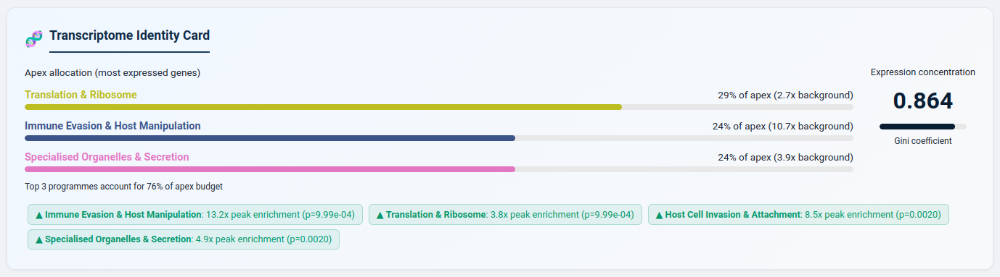
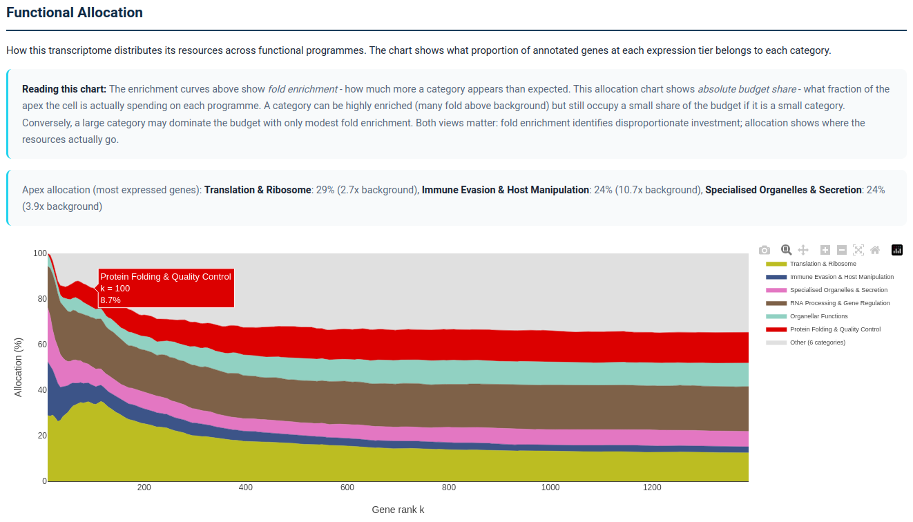

<p align="center">
  
</p>

<p align="center">
  <strong>Statistical Characterisation of Expression Profiles in Transcriptomes</strong>
</p>

<p align="center">
  <a href="https://www.nextflow.io/"></a>
  <a href="https://www.docker.com/"></a>
  <a href="LICENSE"></a>
</p>

<p align="center">
  <em>What is your transcriptome doing, and where is it investing its resources?</em>
</p>

---

You have a transcriptome and you want to know what it is doing: which functional programmes dominate, how the cell allocates its transcriptional budget, and whether the pattern you see is statistically meaningful. You might have one sample with no replicates and you might not have a reference genome. You might be studying a tumour biopsy, a clinical parasite isolate, a drug-resistant bacterial pathogen, an environmental metatranscriptome, or a SARS-CoV-2-infected cell line. Current tools either require replicates and a control condition (DESeq2, edgeR), compress everything into a single score (ssGSEA, GSVA), or stop at one arbitrary threshold (standard GO enrichment).

**SCEPTR takes a different approach.** It computes a continuous enrichment profile for every functional category across the full expression gradient, revealing not just *what* is enriched but *where* in the expression hierarchy that enrichment occurs and *how much* of the cell's resources each programme commands. It works from a single sample against its own background - no replicates, no control condition required. The result is a complete picture of how your organism is investing its transcriptional machinery, from the most highly expressed genes to the transcriptome-wide baseline.

<br>

## What you learn

SCEPTR produces an **interactive HTML report** that tells you:

**Which programmes dominate and where.** Continuous enrichment curves show each functional category's fold enrichment across the full expression gradient. Translation at 9x enrichment in the top 50 genes looks fundamentally different from immune signalling distributed across hundreds of moderately expressed genes - SCEPTR distinguishes these patterns automatically and classifies them as apex-concentrated, distributed, or flat.

**What the cell is spending its budget on.** The Functional Allocation Profile shows what proportion of the expression apex each programme commands. When 41% of a malaria parasite's apex goes to Translation, that is 41% not available for anything else. A category can be highly enriched yet occupy a small budget share if it is a small category - both perspectives matter, and SCEPTR provides both.

<p align="center">
  
  <br>
  <sub><em>Transcriptome Identity Card for <em>Toxoplasma gondii</em> tachyzoites. Translation & Ribosome commands 29% of the apex budget (2.7x background), while Immune Evasion & Host Manipulation takes 24% (10.7x background). Notable findings are flagged automatically with p-values.</em></sub>
</p>

**Whether the patterns are real.** Every enrichment profile is tested against a permutation-based null (1,000 shuffles of gene-category assignments, same smoothing applied to observed and null curves). The report shows 95% null envelopes so you can see exactly where each category departs from random expectation.

**Which genes drive the enrichment.** Each category card in the report lists the specific genes contributing to the enrichment, ranked by expression. For a parasitologist, this means seeing GAPDH, HGXPRT, and KAHRP at the top of the *P. falciparum* Translation apex. For a virologist, this means seeing ISG15, MX1, and IFIT1 driving the Interferon response.

<p align="center">
  
  <br>
  <sub><em>Interactive enrichment profile from the SCEPTR report. Each curve traces a functional category's enrichment across the full expression gradient. Here, Immune Evasion & Host Manipulation dominates the apex of <em>Toxoplasma gondii</em> tachyzoite expression (8.33x at k=15, driven by dense granule effectors). The grey band shows the 95% null envelope. Hover for per-gene-rank values; click legend entries to show/hide.</em></sub>
</p>

<p align="center">
  
  <br>
  <sub><em>Functional Allocation Profile for the same <em>T. gondii</em> transcriptome. The stacked area chart shows how the cell's resource budget redistributes as the expression window broadens. Translation & Ribosome (yellow) dominates the extreme apex, while Immune Evasion (dark blue) and Specialised Organelles (pink) maintain substantial shares throughout. The explanatory callout distinguishes fold enrichment from budget allocation.</em></sub>
</p>

<br>

## Quick Start

### Method only (pip install)

Run SCEPTR on any annotated expression table. No Nextflow, no Docker.

```bash
pip install sceptr-profiling
sceptr profile --expression my_data.tsv --category-set bacteria -o results/
```

See [sceptr/README.md](sceptr/README.md) for input format options and the Python API.

### Full automated framework

Process raw reads to interactive report. Requires [Nextflow](https://www.nextflow.io/) >= 21.10.0 and [Docker](https://www.docker.com/) (or Singularity). ~4 GB disk for databases, ~8 GB RAM recommended.

```bash
# Install Nextflow and Docker if not already available
curl -s https://get.nextflow.io | bash && sudo mv nextflow /usr/local/bin/
sudo apt-get install -y docker.io && sudo usermod -aG docker $USER  # Ubuntu/Debian

# Clone and set up SCEPTR
git clone https://github.com/jsmccabe1/SCEPTR.git && cd SCEPTR
bash setup_databases.sh          # Downloads UniProt + GO (~3.5 GB)
docker build -t sceptr:1.0.0 .
./run_sceptr.sh
```

Or specify everything directly:

```bash
# Parasite study with host filtering
./run_sceptr.sh -r data/reads -t parasite.fasta -c parasite_protozoan -H host.fasta

# Bacterial reference CDS
./run_sceptr.sh -r data/reads -t reference_cds.fasta -c bacteria

# Gram-negative specific (LPS, T3SS/T6SS, porins)
./run_sceptr.sh -r data/reads -t reference_cds.fasta -c bacteria_gram_negative

# De novo dinoflagellate assembly
./run_sceptr.sh -r data/reads -t trinity_assembly.fasta -c protist_dinoflagellate
```

<br>

## Who SCEPTR is for

SCEPTR was built for researchers who have expression data and want to understand what their transcriptome is doing - especially when standard approaches fall short:

- **Single samples without replicates.** Clinical isolates, irreplaceable field samples, experiments before replicates are funded. SCEPTR analyses each sample against its own background, so it works without a control condition.
- **Non-model organisms.** 14 organism-specific category sets cover bacteria, protozoan parasites, helminths, fungi, dinoflagellates, insects, plants, and vertebrate hosts. Custom category sets can be defined for any organism.
- **When "which genes change" is the wrong question.** Differential expression identifies individual genes that differ between conditions. SCEPTR asks a different question: what is the functional architecture of this transcriptome, and how is it allocating resources?

<br>

## Category Sets

SCEPTR ships with organism-specific functional category sets optimised for different study systems:

| Category Set             | Description                             | Example Organisms                        |
|--------------------------|-----------------------------------------|------------------------------------------|
| `general`                | Universal functional categories         | Any organism (default)                   |
| `human_host`             | Human host response (33 detailed pathways) | Human infection, inflammation, clinical studies |
| `vertebrate_host`        | Vertebrate host response (17 broad categories) | Mouse, fish, bird host-side studies      |
| `cancer`                 | Hallmarks of cancer (17 categories)     | Tumour transcriptomes, cell lines        |
| `bacteria`               | Prokaryotic functional systems (14 broad) | *Salmonella*, *E. coli*, *Mycobacterium* |
| `bacteria_gram_negative` | Gram-negative bacteria (18 categories)  | *E. coli*, *Pseudomonas*, *Salmonella*   |
| `bacteria_gram_positive` | Gram-positive bacteria (18 categories)  | *Staphylococcus*, *Streptococcus*, *Bacillus* |
| `parasite_protozoan`     | Protozoan parasite biology              | *Plasmodium*, *Toxoplasma*, *Leishmania* |
| `helminth_nematode`      | Parasitic nematode biology (15 categories) | *Ascaris*, *Haemonchus*, *Brugia*, hookworms |
| `helminth_platyhelminth` | Fluke and tapeworm biology (15 categories) | *Schistosoma*, *Fasciola*, *Echinococcus* |
| `fungi`                  | Fungal biology (15 categories)          | *Aspergillus*, *Candida*, *Fusarium*     |
| `plant`                  | Plant-specific processes                | *Arabidopsis*, crop species              |
| `protist_dinoflagellate` | Dinoflagellate-specific processes        | *Symbiodinium*, HAB species              |
| `insect`                 | Insect biology (16 categories)          | *Drosophila*, mosquitoes, bees, beetles  |

Each category uses **dual-method assignment** (keyword matching + GO hierarchy traversal) with optional **core keywords** that provide high-confidence diagnostic terms. You can also supply your own category definitions in JSON format for any organism or pathway set (including MSigDB, KEGG, Reactome, or custom gene sets).

<details>
<summary><strong>Category set details</strong></summary>

<details>
<summary>bacteria vs bacteria_gram_negative vs bacteria_gram_positive</summary>

The `bacteria` set provides 14 broad functional categories suitable for any prokaryote. The gram-specific sets split and specialise these into 18 categories each, reflecting the distinct biology of gram-negative and gram-positive organisms:

| bacteria (14 broad) | bacteria_gram_negative (18 specific) | bacteria_gram_positive (18 specific) |
|---|---|---|
| Cell Wall & Envelope | Outer Membrane & LPS, Peptidoglycan & Cell Wall, Periplasm & Protein Export | Cell Wall & Peptidoglycan, Teichoic Acids & Surface Polymers, Sortase & Surface Proteins |
| Virulence & Pathogenesis | Virulence & Pathogenesis, Type III Secretion System, Type IV & Type VI Secretion | Virulence & Pathogenesis, Sporulation & Germination, Competence & DNA Uptake |
| Transport & Secretion | Transport & Uptake | Transport & Uptake |
| Signal Transduction | Signal Transduction (AHL quorum sensing) | Signal Transduction (Agr peptide quorum sensing) |
| Antimicrobial Resistance | AMR (ESBL, carbapenemase, AcrAB-TolC) | AMR (vancomycin, methicillin/mecA, erm methylase) |
| Iron Acquisition & Siderophores | Iron Acquisition (enterobactin, pyoverdine, TonB) | Iron Acquisition (Isd heme system, staphyloferrin) |

</details>

<details>
<summary>human_host vs vertebrate_host</summary>

The `human_host` set provides 33 detailed pathway-level categories optimised for human infection, inflammation, and clinical studies. The `vertebrate_host` set provides 17 broader categories suitable for non-human vertebrate hosts (mouse, fish, birds) where pathway-specific annotations are sparser:

| vertebrate_host (17 broad) | human_host (33 detailed) |
|---|---|
| Interferon & Antiviral Response | Interferon Response (Type I), Interferon Response (Type II), Interferon Response (Type III), Antiviral Defense |
| Inflammatory Signaling | TNF-NF-kB Signaling, Chemokine Signaling, Inflammasome & IL-1 Signaling, Interleukin Signaling |
| Signaling Pathways | JAK-STAT Signaling, MAPK-RAS Signaling, PI3K-AKT-mTOR Signaling, TGF-Beta & Developmental Signaling |

</details>

<details>
<summary>helminth_nematode vs helminth_platyhelminth</summary>

Two specialised helminth category sets reflecting distinct biology:

| helminth_nematode (15 categories) | helminth_platyhelminth (15 categories) |
|---|---|
| Cuticle & Molting | Tegument & Surface Biology |
| Dauer & Larval Development | Lifecycle & Morphological Development |
| Sensory & Chemoreception | Neoblasts & Stem Cell Biology |

Both share analogous categories for immune evasion, neuromuscular function, reproduction, digestion, detoxification, metabolism, and signaling, but with organism-specific GO anchors and keywords.

</details>

<details>
<summary>Custom category sets</summary>

```bash
nextflow run main.nf \
  --reads "data/*_{1,2}.fastq.gz" \
  --transcripts assembly.fasta \
  --category_set custom \
  --custom_functional_categories my_functional.json \
  --custom_cellular_categories my_cellular.json \
  -profile docker
```

Category JSON format:

```json
{
  "Category Name": {
    "keywords": ["broad keyword", "another keyword"],
    "anchor_go_ids": ["GO:0000001"],
    "core_keywords": ["diagnostic keyword"]
  }
}
```

</details>
</details>

<br>

## Comparing Two Conditions

If you have two conditions (mock vs infected, control vs treated), SCEPTR can compare their enrichment profiles. This asks a different question from differential expression: not "which genes change?" but "does the functional architecture of the transcriptome shift between states?"

The comparison module uses gene-label permutation testing (10,000 permutations, per-tier BH correction) to assess whether enrichment differences are larger than expected by chance. This is not a replacement for replicated experimental designs - it is a principled way to compare enrichment profiles when replicates are unavailable.

<details>
<summary><b>Usage and outputs</b></summary>

```bash
# Run SCEPTR on each condition, then compare:
./run_sceptr.sh -r data/mock_reads -t reference.fasta -c vertebrate_host -o results_mock
./run_sceptr.sh -r data/infected_reads -t reference.fasta -c vertebrate_host -o results_infected

./run_sceptr.sh --compare \
  --condition-a results_mock/integrated_data/integrated_annotations_expression.tsv \
  --condition-b results_infected/integrated_data/integrated_annotations_expression.tsv \
  --label-a Mock --label-b Infected \
  -c vertebrate_host
```

Both samples must use the same reference transcriptome.

**Outputs:** Differential enrichment TSV (per-category, per-tier fold-change differences with permutation p-values), concordance metrics (Spearman rho with Fisher z-transform CI, Jaccard similarity), and an HTML dashboard with radar overlays, differential heatmaps, and gradient comparison plots.

</details>

<br>

## How the Method Works

<details>
<summary><strong>Continuous enrichment profiling</strong></summary>

Genes are ranked by TPM and the enrichment ratio E<sub>C</sub>(k) is evaluated at every integer gene rank k from k=10 to N/2, then smoothed with an adaptive Gaussian kernel (bandwidth: sigma = max(3, 0.5 * sqrt(N/|C|)), scaling with inter-member spacing) to produce continuous fold-enrichment curves. Profile shapes are classified via normalised linear slope: apex-concentrated (slope < -0.1), distributed (slope > 0.1), or flat.

Statistical significance is assessed by permutation-based global profile test (1,000 gene-category shuffles, supremum statistic, Phipson-Smyth p-value) with 95% null envelope for visual interpretation. Discrete-tier significance uses Fisher's exact test with Benjamini-Hochberg correction.

</details>

<details>
<summary><strong>Functional specialisation and allocation</strong></summary>

**D<sub>KL</sub> divergence** measures how the functional composition at each tier diverges from the whole-transcriptome background. Steep D<sub>KL</sub> gradients indicate extreme apex specialisation; shallow gradients indicate distributed investment.

**Functional Allocation Profiles** show the compositional budget at each tier - what fraction of annotated genes belongs to each category. The **Compositional Apex Distance** (CAD) quantifies apex specialisation using Aitchison distance on the compositional simplex, with permutation significance testing.

</details>

<details>
<summary><strong>Category assignment</strong></summary>

Functional categories are assigned through keyword regex matching against UniProt annotations and GO hierarchy traversal from curated anchor GO terms. Each assignment is tagged with its source (keyword, GO, or both). GO-only ablation recovers 100% of significantly enriched categories across validated organisms (mean r = 0.90), confirming keywords are supplementary. External validation against MSigDB Hallmark gene sets shows 100% concordance with independently curated pathway definitions.

</details>

<br>

## Installation

### Step 1: Clone

```bash
git clone https://github.com/jsmccabe1/SCEPTR.git
cd SCEPTR
```

### Step 2: Download databases

```bash
bash setup_databases.sh           # Full setup (~3.5 GB: UniProt, DIAMOND, GO)
bash setup_databases.sh --check   # Verify database status
```

### Step 3: Build Docker image

```bash
docker build -t sceptr:1.0.0 .
```

<br>

## Usage

### Interactive launcher (recommended)

```bash
./run_sceptr.sh
```

Auto-detects read files, validates inputs, and supports four modes: full framework, method only, compare conditions, and re-run enrichment.

### Command-line examples

```bash
./run_sceptr.sh -r data/reads -t assembly.fasta -c bacteria              # Paired-end
./run_sceptr.sh -r 'data/*.fastq.gz' -t cds.fasta -c bacteria --single-end  # Single-end
./run_sceptr.sh -r data/reads -t parasite.fasta -c parasite_protozoan -H host.fasta  # With host removal
```

### Organism-aware processing

SCEPTR automatically adapts based on `--category_set`:

| Feature               | Eukaryote (default)               | Bacteria / Bacteria Gram-*          | Vertebrate Host                   |
|-----------------------|-----------------------------------|-------------------------------------|-----------------------------------|
| ORF prediction        | TransDecoder                      | Direct CDS translation (table 11)   | Direct CDS translation (table 1)  |
| Contaminant filtering | Enabled                           | Auto-skipped                        | Auto-skipped                      |
| Input expectation     | Trinity assembly or transcriptome | Reference CDS file                  | Reference CDS file (e.g. Ensembl) |

<details>
<summary><strong>Full parameter reference</strong></summary>

### Required

| Parameter       | Description                                                              |
|-----------------|--------------------------------------------------------------------------|
| `--reads`       | Read files, glob pattern (e.g., `"data/*_{1,2}.fastq.gz"`) or directory |
| `--transcripts` | Reference transcriptome or CDS FASTA file                                |

### Key options

| Parameter            | Default          | Description                               |
|----------------------|------------------|-------------------------------------------|
| `--category_set`     | `general`        | Functional category set (see table above) |
| `--single_end`       | `false`          | Enable single-end read mode               |
| `--outdir`           | `results`        | Output directory                          |
| `--output_prefix`    | `sceptr`         | Prefix for output files                   |
| `--expression_tiers` | `50,100,250,500` | Comma-separated expression tier sizes     |

### Continuous enrichment

| Parameter                      | Default | Description                                        |
|--------------------------------|---------|----------------------------------------------------|
| `--explot_continuous`          | `true`  | Compute continuous enrichment functions             |
| `--explot_continuous_step`     | `5`     | Output resampling step                              |
| `--explot_profile_permutations`| `1000`  | Permutations for global profile significance test   |

### Host filtering (parasite/pathogen studies)

| Parameter              | Default | Description                                   |
|------------------------|---------|-----------------------------------------------|
| `--host_transcriptome` | -       | Host transcriptome FASTA (will be translated) |
| `--host_proteome`      | -       | Host proteome FASTA (used directly, faster)   |

### Cross-sample comparison

| Parameter           | Default  | Description                                     |
|---------------------|----------|-------------------------------------------------|
| `--condition_a`     | -        | Path to condition A integrated results TSV      |
| `--condition_b`     | -        | Path to condition B integrated results TSV      |
| `--label_a`         | `Condition_A` | Display label for condition A              |
| `--label_b`         | `Condition_B` | Display label for condition B              |
| `--n_permutations`  | `10000`  | Number of gene-label permutations               |

</details>

<br>

## Citation

If you use SCEPTR in your research, please cite:

> McCabe, J.S., and Janouskovec, J. (2026). SCEPTR: continuous enrichment profiling reveals functional architecture across the expression gradient.

## License

MIT License. See [LICENSE](LICENSE) for details.

## Issues & Contributions

Bug reports and feature requests: [GitHub Issues](https://github.com/jsmccabe1/SCEPTR/issues)
